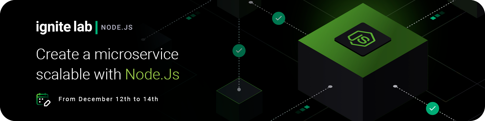

# Ignite Lab 04 - Node.js 🧪

An online and free programming event in practice. We build a scalable microservice with Node.js, NestJS, Prisma, TypeScript, Redis.

During the event we developed a notification microservice.

One of the pillars of this development was the importance of unit testing. We coded the application without uploading it to any server. The entire process was carried out using validation tests

> The `assets` folder and the `notes.md and README.md` files located in the root folder of the application have no connection with the functioning of the project, they are contents only to establish this `README` and for personal use. You can delete it if you want.

---

### Documentations:

[Project Repository](https://github.com/marcg-dev/igniteLab4NodeJs/tree/master/notification-service)
[Rocketseat Repository](https://github.com/rocketseat-education/ignite-lab-nodejs)

---

### Technologies used:

[`Node.js`](https://github.com/nodejs/node) | [`TypeScript`](https://github.com/microsoft/TypeScript) | [`Nest`](https://github.com/nestjs/nest) | [`Prisma`](https://github.com/prisma) | [`Redis`](https://redis.io/) | [`Faker`]() | [`Insomnia`](https://github.com/Kong/insomnia)

---

### Packges:
- :octocat:	[class-validator](https://github.com/typestack/class-validator)
- :octocat:	[class-transformer](https://github.com/typestack/class-transformer)

---

### Mestre

:eight_pointed_black_star: [@diego3g](https://github.com/diego3g)

## #NeverStopLearning